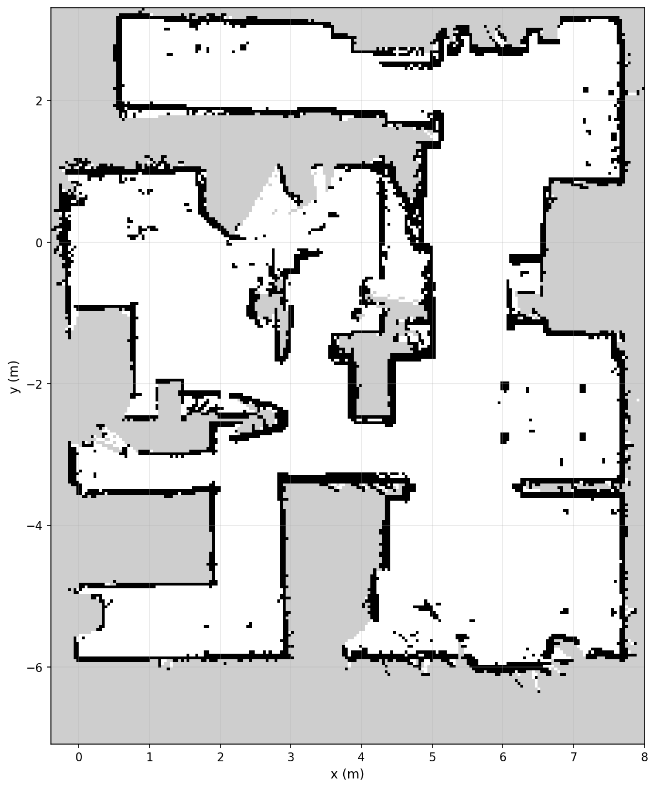
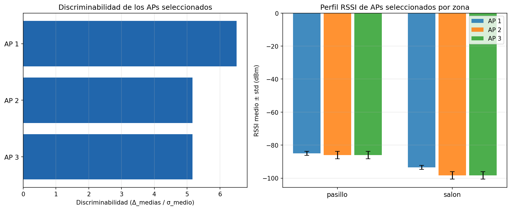
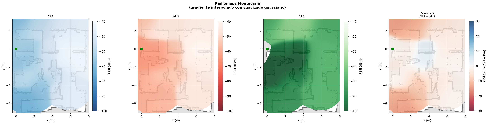
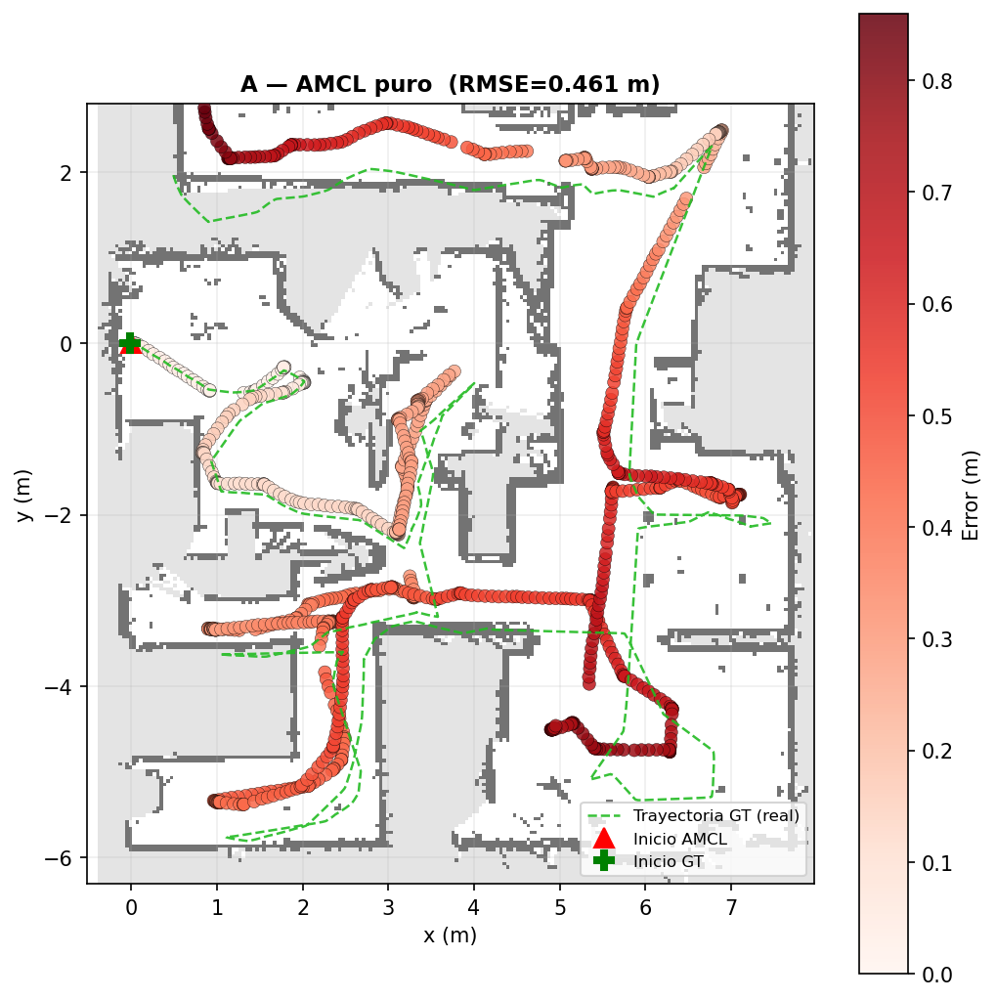
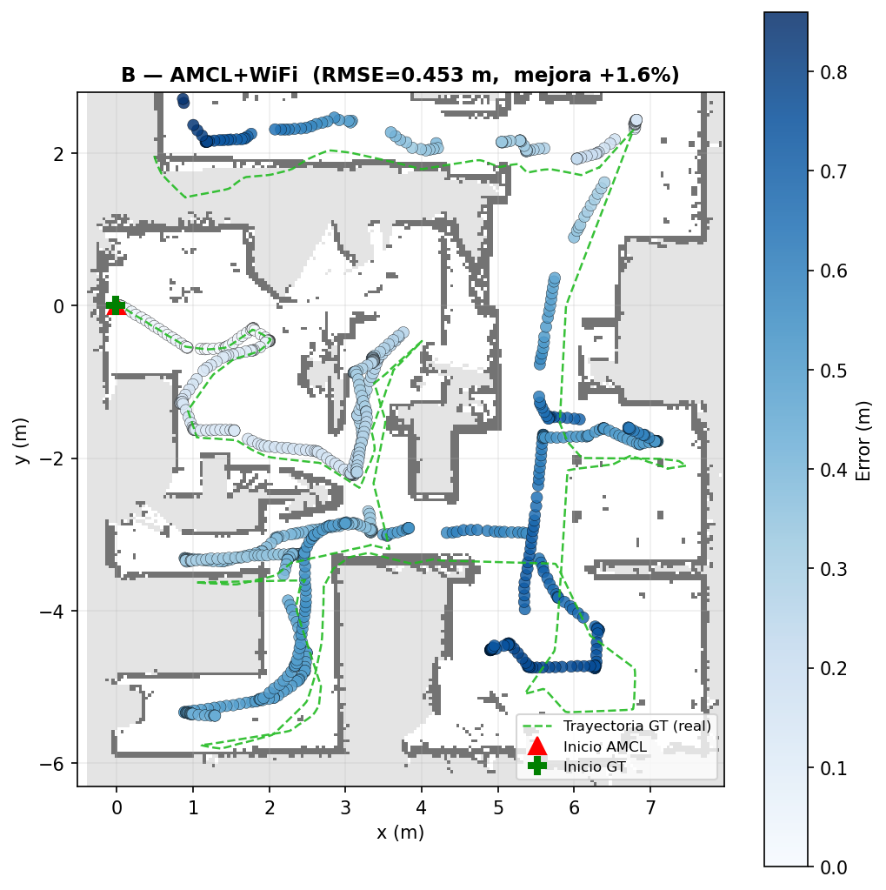
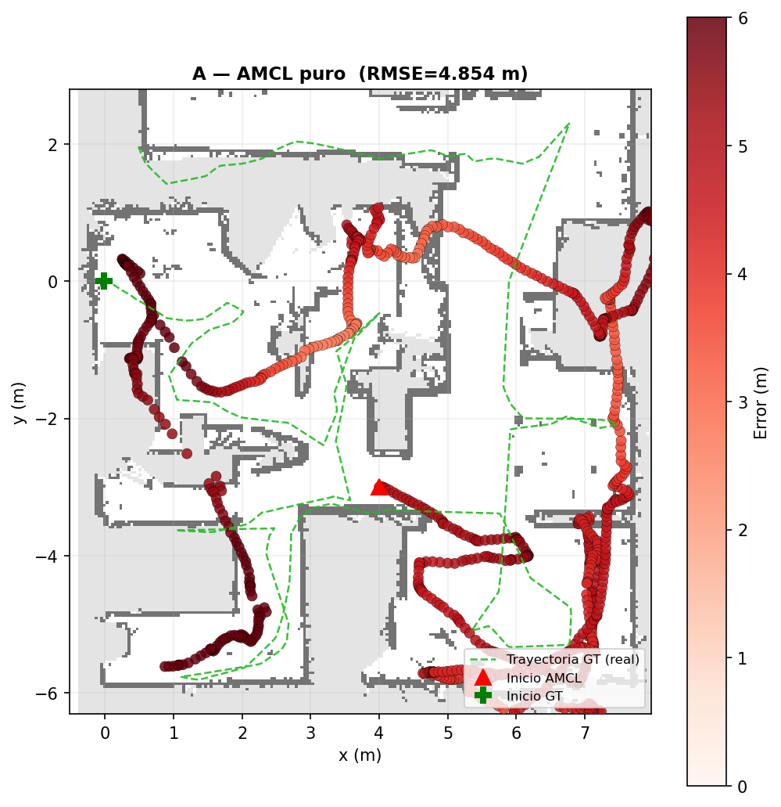
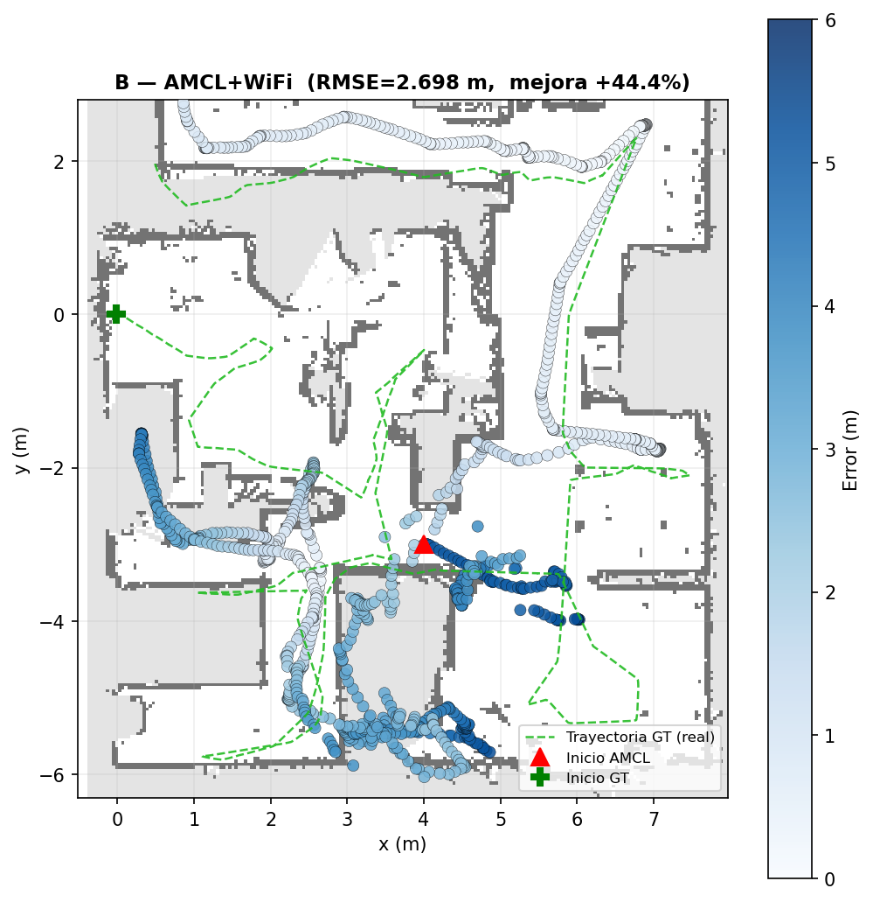
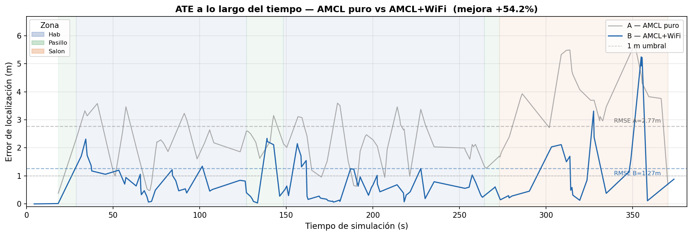
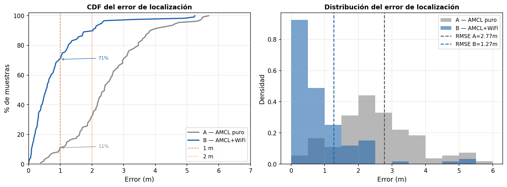

# "Método Montecarla": Paquete de ROS2 para localización precisa en presencia de redes WiFi con ROSbot 2R

**TFG · Grado en Ingeniería Electrónica, Robótica y Mecatrónica · Universidad de Sevilla · 2026**  
Autor: Adrián Morales Alfonso &nbsp;|&nbsp; Tutor: David Alejo

---

## ¿Qué problema resuelve?

El localizador AMCL estándar de ROS 2 usa únicamente el LiDAR para estimar la posición del robot dentro de un mapa conocido. En entornos con zonas geométricamente simétricas (dos habitaciones del mismo tamaño y forma), el filtro de partículas puede confundirse porque el láser "ve" lo mismo en ambas.

**Montecarla** fusiona la señal WiFi (fingerprinting) con el LiDAR dentro del filtro de partículas. Aunque dos habitaciones sean idénticas para el LiDAR, los routers emiten con intensidades distintas en cada zona, permitiendo distinguirlas. 

**Proyecto base extendido:** [rosbot-demo-wifi-heatmap (Husarion)](https://github.com/husarion/rosbot-demo-wifi-heatmap)

---

## Mapa del entorno experimental

Mapa SLAM generado con slam_toolbox. Resolución 0.04 m/píx (210×260 celdas).



---

## Arquitectura del sistema

```
[Survey WiFi]  →  [Selección APs]  →  [Radiomap]  →  [Experimento A/B]  →  [ATE]
 ROSbot graba      Script elige         Mapa de         Replay del bag         RMSE de
 señal WiFi +      los N APs más        señal WiFi       con AMCL puro (A)      trayectoria
 odometría         discriminadores      interpolado      o AMCL+WiFi (B)        estimada vs GT
```

| Componente | Función | Dónde corre |
|---|---|---|
| `wifi-scanner` | Publica señal WiFi de todos los APs visibles vía `iw scan dump` | ROSbot 2R (Docker) |
| `slam-toolbox` | Genera el mapa SLAM del entorno | ROSbot 2R (Docker) |
| `montecarla_amcl` | Fork de nav2_amcl con fusión WiFi (C++) | PC x86_64 (Docker) |
| `seleccionar_aps.py` | Analiza el bag de survey y elige los APs más discriminadores | PC (Python) |
| `construir_radiomap.py` | Genera el mapa de señal WiFi interpolado (RBF thin-plate-spline) | PC (Python) |
| `ate_calc.py` / `ate_real.py` | Calcula ATE RMSE comparando trayectoria estimada con ground truth | PC (Python) |
| `graficar_ate.py` | Genera gráficas de error temporal, distribución y mapa de error espacial | PC (Python) |

---

## Requisitos

### Hardware
- **ROSbot 2R** (Husarion) con:
  - LiDAR RPLidar A2/A3 u equivalente
  - Adaptador WiFi con soporte para `iw scan dump` (sin modo monitor)
- **PC** Ubuntu 22.04 con conexión LAN al ROSbot (Ethernet o WiFi)

### Software

| Herramienta | Versión mínima |
|---|---|
| Ubuntu | 22.04 LTS |
| Docker Engine + Compose v2 | 24.0 + 2.20 |
| ROS 2 Humble (para análisis offline) | Humble Hawksbill |
| Python | 3.10 |

Dependencias Python (análisis offline):
```bash
pip install numpy scipy matplotlib pillow pyyaml
```

---

## Flujo completo paso a paso

### 0. Clonar el repositorio
```bash
git clone https://github.com/<usuario>/MontecarlaRosbot.git
cd MontecarlaRosbot
```

### 1. Crear el mapa SLAM del entorno (ROSbot)
```bash
# En el ROSbot: arranca SLAM + wifi-scanner + grabador de bag
docker compose -f docker-compose/compose.rosbot.yaml up
```
Conduce el robot con el joystick o mediante RViz hasta cubrir todo el entorno.  
El bag se guarda en `~/real_bags/survey_YYYYMMDD_HHMMSS`.

### 2. Seleccionar los APs más discriminadores (PC)
```bash
source /opt/ros/humble/setup.bash
python3 montecarla_real/seleccionar_aps.py \
    --bag ~/real_bags/survey_YYYYMMDD_HHMMSS \
    --n 3 \
    --salida docker-compose/config/real/
```
Genera `aps_seleccionados.yaml` y `aps_analisis.png` con la discriminabilidad de cada AP.

### 3. Construir el radiomap (PC)
```bash
python3 montecarla_sim/radiomap_builder/construir_radiomap.py \
    --bag   ~/real_bags/survey_YYYYMMDD_HHMMSS \
    --aps   docker-compose/config/real/aps_seleccionados.yaml \
    --mapa  docker-compose/maps/<tu_mapa>.yaml \
    --salida docker-compose/maps/
```
Copia `docker-compose/maps/radiomap_meta.yaml.example` → `radiomap_meta.yaml` y edítalo con los BSSIDs generados.

### 4. Experimento A — AMCL solo LiDAR (baseline)
```bash
BAG_NAME=<bag_gt> WIFI_ENABLED=false \
  docker compose -f docker-compose/compose.real_experimentos.yaml up
```

### 5. Experimento B — AMCL + WiFi
```bash
BAG_NAME=<bag_gt> WIFI_ENABLED=true \
  docker compose -f docker-compose/compose.real_experimentos.yaml up
```

### 6. Calcular ATE
```bash
source /opt/ros/humble/setup.bash
python3 montecarla_sim/analysis/ate_calc.py \
    --gt   ~/real_bags/<bag_gt> \
    --base ~/real_bags/<exp_A_bag> \
    --wifi ~/real_bags/<exp_B_bag> \
    --real \
    --salida ate_resultado.txt
```

### 7. Visualizar resultados
```bash
python3 montecarla_sim/analysis/graficar_ate.py \
    --gt   ~/real_bags/<bag_gt> \
    --base ~/real_bags/<exp_A_bag> \
    --wifi ~/real_bags/<exp_B_bag> \
    --real --modo-real \
    --mapa docker-compose/maps/<tu_mapa>.yaml \
    --salida resultados/
```

---

## Resultados experimentales

### Discriminabilidad y radiomap de los APs seleccionados

El script `seleccionar_aps.py` ordena cada AP por su capacidad de distinguir zonas (Δ_medias / σ_medio). Solo se seleccionan los que tienen perfiles RSSI claramente distintos por zona.



El radiomap resultante muestra el gradiente de señal de cada AP sobre el mapa SLAM:



---

### Experimento base — condiciones normales

El robot arranca en la posición correcta y recorre el entorno normalmente. Ambos modos convergen desde el inicio; la mejora del WiFi es marginal en este escenario.

| | AMCL puro | AMCL + WiFi | Mejora |
|---|:---:|:---:|:---:|
| **RMSE** | 0.461 m | 0.453 m | +1.6% |
| % poses < 1 m | 100% | 100% | — |

| AMCL puro (A) | AMCL + WiFi (B) |
|:---:|:---:|
|  |  |

*Puntos = poses estimadas por AMCL, coloreadas por error (azul=bajo, rojo=alto). Línea verde discontinua = trayectoria real (ground truth).*

---

### Experimento kidnapped — robot desplazado

El robot arranca convencido de estar en una posición incorrecta (4.0, −3.0). Sin WiFi, el AMCL **nunca** recupera la localización correcta porque el LiDAR no puede distinguir en qué habitación está. Con WiFi, converge en ~135 segundos.

| | AMCL puro | AMCL + WiFi | Mejora |
|---|:---:|:---:|:---:|
| **RMSE** | 4.854 m | 2.698 m | **+44.4%** |
| Convergencia (err < 1 m) | Nunca | ~135 s | — |

| AMCL puro — nunca converge (A) | AMCL + WiFi — converge ~135 s (B) |
|:---:|:---:|
|  |  |

---

### Simulación — entorno simétrico (Gazebo)

Casa simulada con dormitorio y cocina de geometría idéntica. Escenario diseñado para forzar la confusión del LiDAR. Resultado más representativo del beneficio teórico del sistema.

| | AMCL puro | AMCL + WiFi | Mejora |
|---|:---:|:---:|:---:|
| **RMSE** | 2.772 m | 1.271 m | **+54.2%** |
| % poses < 1 m | 29% | 71% | +42 pp |

Parámetros finales: `wifi_sigma=5.0 dBm`, `wifi_alpha=0.9`, `max_particles=8000`.

| Error a lo largo del tiempo | Distribución acumulada del error |
|:---:|:---:|
|  |  |

---

## Estructura del repositorio

```
MontecarlaRosbot/
├── docker-compose/
│   ├── compose.rosbot.yaml              # Survey WiFi + SLAM en el robot
│   ├── compose.real_experimentos.yaml   # Experimentos A/B (replay)
│   ├── compose.real_replay.yaml         # Replay libre
│   ├── compose.sim.yaml                 # Simulación Gazebo
│   ├── compose.pc.yaml / .lan.yaml      # Monitorización desde el PC
│   ├── config/
│   │   ├── real/
│   │   │   ├── aps_seleccionados.yaml   # APs elegidos (generado por seleccionar_aps.py)
│   │   │   └── checkpoints_ejemplo.yaml # Plantilla de checkpoints por zona
│   │   └── sim/
│   │       └── aps.yaml                 # APs simulados
│   └── maps/
│       ├── casa_simple.pgm / .yaml      # Mapa de simulación
│       ├── radiomap_meta.yaml.example   # Plantilla para radiomap_meta.yaml (¡copiar y rellenar!)
│       └── ver_radiomaps.py             # Visualizador de radiomaps sobre el mapa SLAM
├── montecarla_amcl/                     # Fork de nav2_amcl con fusión WiFi (C++)
├── montecarla_msgs/                     # Mensajes ROS 2: WifiScan, WifiMeasurement
├── montecarla_real/
│   ├── seleccionar_aps.py               # Analiza discriminabilidad de APs por zona
│   ├── registrar_checkpoints.py         # Registra checkpoints físicos durante experimento
│   ├── ate_real.py                      # Calcula ATE para bags reales
│   └── wifi_scanner/                    # Nodo ROS 2: publica señal WiFi real (iw scan dump)
├── montecarla_sim/
│   ├── analysis/
│   │   ├── ate_calc.py                  # Cálculo de ATE RMSE (sim y real)
│   │   └── graficar_ate.py              # Gráficas: error temporal, distribución, mapa espacial
│   ├── radiomap_builder/
│   │   └── construir_radiomap.py        # Genera radiomap.npy desde bag de survey
│   ├── wifi_simulator/                  # Nodo ROS 2: simula señal WiFi (path-loss + NLOS)
│   └── worlds/                          # Mundos SDF para Gazebo (casa simétrica)
├── mapper-packages/                     # Demo original Husarion (waypoints + heatmap básico)
├── nav2-wifi-heatmap/                   # Integración Nav2 WiFi original
└── docs/images/                         # Imágenes para este README
```

---

## Configuración de red (LAN local)

El sistema funciona sin VPN en LAN local. PC y ROSbot deben tener el mismo `ROS_DOMAIN_ID`.

```bash
# Variables ya configuradas en los ficheros compose:
ROS_DOMAIN_ID=0
RMW_IMPLEMENTATION=rmw_fastrtps_cpp
```

Para usar VPN Husarnet (conexión remota), sustituir por los ficheros `compose.*.husarnet.yaml`.

---

## Créditos y atribución

| Componente | Origen | Licencia |
|---|---|---|
| nav2_amcl | Navigation2 project (Open Robotics / Intel) | Apache 2.0 |
| rosbot-demo-wifi-heatmap | Husarion sp. z o.o. | Apache 2.0 |
| mapper-packages | S. Dudiak / Husarion | Apache 2.0 |
| **Extensiones Montecarla** | Adrián Morales — Universidad de Sevilla | Apache 2.0 |

Las extensiones propias incluyen: `montecarla_amcl` (fusión WiFi en C++), `montecarla_msgs`, `montecarla_real/`, scripts de análisis ATE y construcción de radiomap.

---

## Licencia

Apache License 2.0 — ver [LICENSE](LICENSE).
